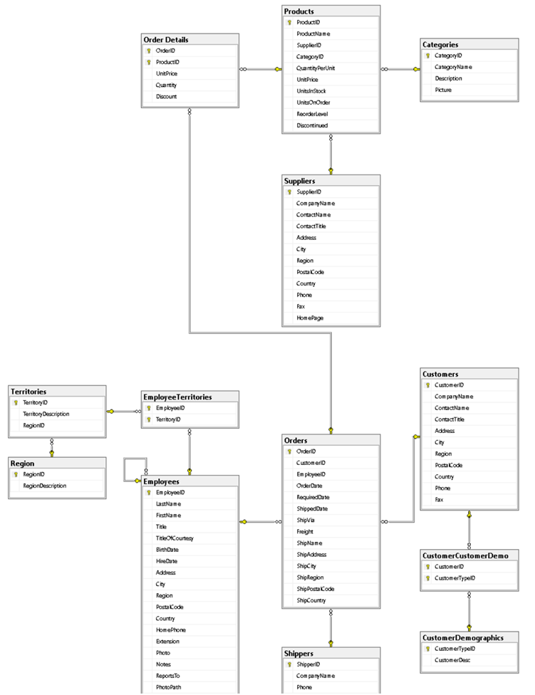

# SQL Homework 2

Created By: Miguel López
Date: September 12, 2018 10:09 AM
Tested ON: Miscrosoft SQL Server 2017

---

## INSTRUCCIONES

USANDO LA FAMILIA DE VISTAS DE LA BASE DE DATOS NORTHWIND CONTESTAR LAS SIGUIENTES CONSULTAS.



---

## CONSULTAS

1. CONSULTA CON EL NOMBRE DEL EMPLEADO Y TOTAL DE ORDENES REALIZADAS EN 1998.

```sql

```

2. CONSULTA CON EL NOMBRE DE LA CATEGORIA Y TOTAL DE PRODUCTOS QUE SURTE QUE INICIEN CON VOCAL

```sql

```

3. CONSULTA CON EL NOMBRE DEL CLIENTE Y TOTAL DE ORDENES, MOSTRAR SOLAMENTE LOS CLIENTES CON MAS DE 30 ORDENES

```sql

```

4. CONSULTA EL AÑO QUE MAS ORDERNES REALIZO

```sql

```

6. CONSULTA CON EL NOMBRE DEL MEJOR EMPLEADO DE 1998, OSEA EL QUE HAYA REALIZADO MAS ORDENES EN 1998

```sql

```

7. CONSULTA CON EL NOMBRE DEL TERRITORIO Y TOTAL DE EMPLEADOS QUE ATIENDEN DICHO TERRITORIO, MOSTRAR SOLAMENTE LOS TERRITORIOS CON 2 O MENOS EMPLEADOS ASIGNADOS

```sql

```

8. CONSULTA CON EL NOMBRE DEL PROVEEDOR Y EL TOTAL DE ARTICULOS QUE SURTE

```sql

```

9. CONSULTA CON EL NOMBRE DE LA CATEGORIA Y EL PRECIO DEL PRODUCTO MAS CARO Y MAS BARATO DE ESA CATEGORIA

```sql

```

10. CONSULTA CON EL NOMBRE DE LA COMPAÑIA DE ENVIO, EL AÑO, Y EL TOTAL DE ENVIOS REALIZADOS EN ESE AÑO

```sql

```

11. CONSULTA CON LA CLAVE DE LA ORDEN, EL TOTAL DE ARTICULOS VENDIDOS EN LA ORDEN Y EL IMPORTE TOTAL DE LA ORDEN, MOSTRANDO SOLAMENTE LAS ORDENES CON IMPORTE MAYOR A $1000.00

```sql

```

12. CONSULTA CON EL NOMBRE DEL TERRITORIO Y EL TOTAL DE EMPLEADOS QUE ATIENDEN DICHO TERRITORIO

```sql

```

13. CONSULTA CON EL NOMBRE DEL EMPLEADO Y EL TOTAL DE EMPLEADOS A SU CARGO

```sql

```

14. CONSULTA CON LA CLAVE DE LA ORDEN, IMPORTE Y TOTAL DE LA ORDEN. MOSTRAR LAS ORDENES QUE HAYAN VENDIDO MAS DE 5 ARTICULOS DIFERENTES

```sql

```

15. CONSULTA CON EL AÑO, MES Y TOTAL DE ORDENES REALIZADAS EN ESE PERIODO

```sql

```

16. CONSULTA CON EL NOMBRE DE LA REGION Y TOTAL DE TERRITORIOS DE DICHA REGION

```sql

```

17. CONSULTA CON LA CLAVE DE LA ORDEN Y TOTAL DE ÓRDENES CANCELADAS

```sql

```
