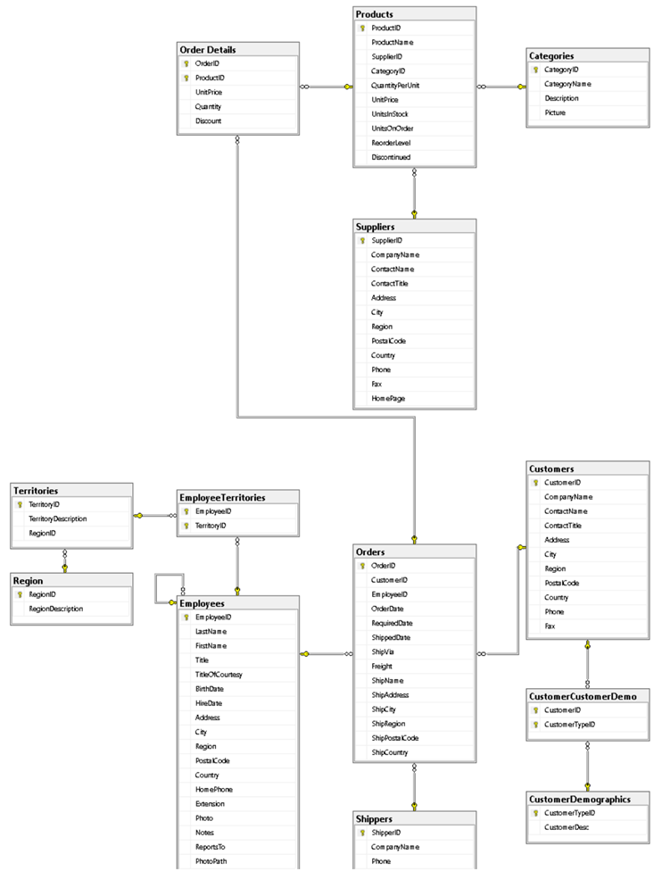

# SQL Homework 2 - INNER JOIN

Created By: Miguel López
Date: September 9, 2018 1:32 PM
Tested ON: Miscrosoft SQL Server 2017

---

## INSTRUCCIONES

USANDO LA FAMILIA DE VISTAS DE LA BASE DE DATOS NORTHWIND CONTESTAR LAS SIGUIENTES CONSULTAS.



## CONSULTAS

1. CONSULTA CON EL FOLIO Y FECHA DE LA ORDEN CUYO A�O SEA MULTIPLO DE 3 Y EL MES TERMINE CON VOCAL

```sql
SELECT OrderDate,OrderID--, DATENAME(MONTH,OrderDate)
FROM Orders
WHERE YEAR(OrderDate) % 3 = 0 AND
	  DATENAME(MONTH,OrderDate) LIKE  '%[aeiou]'
```

2. CONSULTA CON EL FOLIO DE LA ORDEN , FECHA Y CLAVE DEL EMPLEADO QUE SE HAYAN REALIZADO LOS DIAS LUNES, MIÉRCOLES Y VIERNES

```sql
SELECT OrderID,OrderDate,EmployeeID, DATENAME(dw,OrderDate),DATEPART(dw,OrderDate)
FROM Orders
WHERE DATEPART(dw,OrderDate) IN (2,4,6)
```

3. CONSULTA CON LAS PRIMERAS 10 ORDENES DE 1997

```sql
SELECT TOP 10 *, YEAR(OrderDate)
FROM Orders
WHERE YEAR(OrderDate) = 1997
order by OrderDate ASC
```

4. CONSULTA CON EMPLEADOS CON  QUE VIVAN EN UN BLVD Y NO TENGAN UNA REGION ASIGNADA

```sql
SELECT * FROM Employees WHERE Address LIKE  '%blvd%' AND  Region IS NULL
```

5. CONSULTA CON EL NOMBRE DEL PRODUCTO, NOMBRE DEL PROVEEDOR Y NOMBRE DE LA CATEGORIA. MOSTRAR SOLO LOS PROVEEDORES QUE NO TENGAN FAX Y QUE SI TENGAN HOMEPAGE

```sql
SELECT p.ProductName, p.SupplierID, p.CategoryID--, s.Fax, s.HomePage
FROM Products AS p
INNER JOIN Suppliers AS s ON p.SupplierID = s.SupplierID
WHERE s.Fax IS NULL AND
	  s.HomePage IS NOT NULL
```

6. CONSULTA CON EL NOMBRE DEL EMPLEADO Y NOMBRE DEL TERRITORIO QUE ATIENDE

```sql
SELECT EmployeeName = (e.FirstName +' '+  e.LastName),t.TerritoryDescription
FROM EmployeeTerritories AS et
INNER JOIN Employees AS e ON et.EmployeeID = e.EmployeeID
INNER JOIN Territories AS t ON et.TerritoryID = t.TerritoryID
```

7. CONSULTA CON EL FOLIO DE LA ORDEN, MESES TRANSCURRIDOS DE LA ORDEN, NOMBRE DEL EMPLEADO QUE HIZO LA ORDEN. MOSTRAR SOLO LAS ORDENES DE LOS EMPLEADO QUE VIVAN EN EL PAIS `USA` Y QUE EL CODIGO POSTAL CONTENGA UN `2`

```sql
SELECT MTHSDIFF = DATEDIFF(MONTH,OrderDate,GETDATE()), EmployeeName =  (e.FirstName +' '+ e.LastName), e.Country, e.PostalCode
FROM Orders AS o
INNER JOIN Employees AS e ON o.EmployeeID = e.EmployeeID
WHERE e.Country = 'USA' AND
	  e.PostalCode LIKE  '%2%'
```

8. CONSULTA CON EL FOLIO DE LA ORDEN, NOMBRE DEL PRODUCTO E IMPORTE DE VENTA. MOSTRAR SOLO LAS ORDENES DE LOS PRODUCTOS CUYA CATEGERIA CONTENGA DOS VOCALES SEGUIDAS

```sql
SELECT od.OrderID, p.ProductName, Total = ((od.UnitPrice - od.Discount) * Quantity), c.CategoryName
FROM [Order Details] AS od
INNER JOIN Products AS p ON od.ProductID = p.ProductID
INNER JOIN Categories AS c ON p.CategoryID = c.CategoryID
WHERE c.CategoryName LIKE  '%[aeiou][aeiuo]%'
```

9. CONSULTA CON EL NOMBRE DEL EMPLEADO, NOMBRE DEL TERRITORIO QUE ATIENDE. MOSTRAR SOLO LOS EMPLEADOS QUE EL TERRITORIO ESTE EN UNA REGION QUE EMPIECE CON VOCAL Y TERMINE CON CONSONANTE

```sql
SELECT EmployeeName = (e.FirstName + ' ' + e.LastName), t.TerritoryDescription
FROM EmployeeTerritories AS et
INNER JOIN Employees AS e ON et.EmployeeID = e.EmployeeID
INNER JOIN Territories AS t ON et.TerritoryID = t.TerritoryID
WHERE t.TerritoryDescription LIKE  '[aeiou]%[^aeiou]'
```

10. CONSULTA CON EL FOLIO DE LA ORDEN, FECHA DE LA ORDEN, NOMBRE DEL EMPLEADO, EDAD QUE TENIA EL EMPLEADO CUANDO HIZO LA ORDEN

```sql
SELECT o.OrderID, o.OrderDate, EmployeeName = (e.FirstName + ' ' + e.LastName), EmployeeAgeAtOrder = DATEDIFF( year, e.BirthDate, o.OrderDate )
FROM Orders AS o
INNER JOIN Employees AS e ON o.EmployeeID = e.EmployeeID
```
