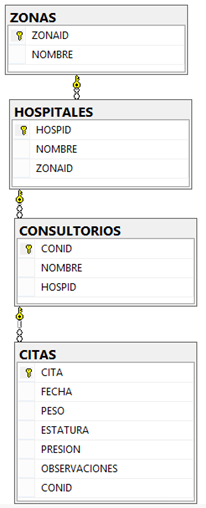

# SQL Homework 4.1 - VISTAS CONSULTORIOS

Created By: Miguel López
Date: September 19, 2018 12:43 PM
Tested ON: Miscrosoft SQL Server 2017

---

## INSTRUCCIONES

CREAR LA FAMILIA DE VISTAS DE LA SIGUIENTE BD:



ENTREGAS:

- [CREACIÓN DE TABLAS](#CREACIÓN-DE-TABLAS)
- [LLAVES PRIMARIAS](#LLAVES-PRIMARIAS)
- [LLAVES FORÁNEAS](#LLAVES-FORÁNEAS)
- [CREACIÓN DE VISTAS](#CREACIÓN-DE-VISTAS)
- [INSERTAR 5 DATOS A CADA TABLA](#INSERTAR-DATOS)
- [CONSULTAS](#CONSULTAS)

[Script AQUI](scripts/Vistas.sql)

---

## CREACIÓN DE TABLAS

```sql
CREATE DATABASE HOSPITALES
GO
USE HOSPITALES
GO

CREATE TABLE ZONAS(
ZONAID INT NOT NULL,
NOMBRE VARCHAR (50) NOT NULL
)

CREATE TABLE HOSPITALES(
HOSPID INT NOT NULL,
NOMBRE VARCHAR(50) NOT NULL,
ZONAID INT NOT NULL
)

CREATE TABLE CONSULTORIOS(
CONID INT NOT NULL,
NOMBRE VARCHAR(50) NOT NULL,
HOSPID INT NOT NULL
)

CREATE TABLE CITAS(
CITA INT NOT NULL,
FECHA DATETIME NOT NULL,
PESO DECIMAL(5,2) NOT NULL,
ESTATURA DECIMAL (3,2) NOT NULL,
PRESION DECIMAL (5,2) NOT NULL,
OBSERVACIONES VARCHAR(300) NOT NULL,
CONID INT NOT NULL
)
```

---

## LLAVES PRIMARIAS

```sql
ALTER TABLE ZONAS ADD CONSTRAINT PK_ZONAS PRIMARY KEY (ZONAID)

ALTER TABLE HOSPITALES ADD CONSTRAINT PK_HOSPITALES PRIMARY KEY(HOSPID)

ALTER TABLE CONSULTORIOS ADD CONSTRAINT PK_COSULTORIOS PRIMARY KEY(CONID)

ALTER TABLE CITAS ADD CONSTRAINT PK_CITAS PRIMARY KEY(CITA)
```

---

## LLAVES FORÁNEAS

```sql
ALTER TABLE HOSPITALES ADD CONSTRAINT FK_HOSPITALES_ZOANAS FOREIGN KEY (ZONAID)
REFERENCES ZONAS(ZONAID)
GO
ALTER TABLE CONSULTORIOS ADD CONSTRAINT FK_CONSULTORIOS_HOSPITALES FOREIGN KEY(HOSPID)
REFERENCES HOSPITALES(HOSPID)
GO
ALTER TABLE CITAS ADD CONSTRAINT FK_CITAS_CONSULTORIO FOREIGN KEY(CONID)
REFERENCES CONSULTORIOS (CONID)
```

---

## RESTRICCIONES CHECK

```sql
ALTER TABLE CITAS ADD CONSTRAINT CC_CITA_PESO CHECK (PESO>0),
CONSTRAINT CC_CITA_ESTATURA CHECK(ESTATURA>0),CONSTRAINT CC_CITA_PRESION CHECK(PRESION>0)
```

---

## VALORES DEFAULT

```sql
ALTER TABLE CITAS ADD CONSTRAINT DF_CITA_OBSERVACION DEFAULT ('EL PACIENTE TIENE GRIPA') FOR OBSERVACIONES
```

---

## INSERTAR DATOS

```sql
INSERT INTO ZONAS VALUES (1,'ZONA SUR'),(2,'ZONA NORTE'),(3,'ZONA ESTE'),(4,'ZONA OESTE'),(5,'ZONA CENTRO')
GO
INSERT INTO HOSPITALES VALUES (1,'HOSPITAL GENERAL',2),(2,'HOSPITAL DE LA MUJER',1),
(3,'HOSPITAL DE SPRINGFIELD',3),(4,'IMMS',5),(5,'ISSTE',4)
INSERT INTO CONSULTORIOS VALUES (1,'ODONTOLOGIA',3),(2,'PEDIATRIA',4),(3,'DERMATOLOGIA',2),(4,'GENERAL',1),(5,'CARDIOLOGIA',5)
GO
INSERT INTO CITAS VALUES (1,'30-01-2017 11:20:00.12',70.543,1.70,150,'IMPERFECCIONES',3),
(2,'02-02-2017 12:35:18.12',60.453,1.64,160.44,'MUELA DEL JUICIO',1),
(3,'02-04-2017 15:12:20.23',80.172,1.80,158.88,default,2),
(4,'03-05-2017 17:14:10.43',90.120,1.86,170.66,'OCUPA MARCAPASOS',5),
(5,'04-06-2017 10:02:52.31',50.725,1.54,166.74,default,4)
```

---

## CREACIÓN DE VISTAS

```sql
CREATE VIEW VW_HOSPITALES AS
SELECT H.HOSPID,H.NOMBRE,Z.ZONAID,ZONANOMBRE=Z.NOMBRE
FROM HOSPITALES H
INNER JOIN ZONAS Z ON Z.ZONAID=H.ZONAID
GO
CREATE VIEW VW_CONSULTORIOS AS
SELECT C.CONID,C.NOMBRE,H.HOSPID,HOSPNOMBRE=H.NOMBRE,H.ZONAID,H.ZONANOMBRE
FROM CONSULTORIOS C
INNER JOIN VW_HOSPITALES H ON C.HOSPID=H.HOSPID
GO
CREATE VIEW VW_CITAS AS
SELECT C.CITA,C.FECHA,C.PESO,C.ESTATURA,C.PRESION,C.OBSERVACIONES, CN.CONID,CONNOMBRE=CN.NOMBRE,CN.HOSPID,CN.HOSPNOMBRE,CN.ZONAID,CN.ZONANOMBRE
FROM  CITAS C
INNER JOIN VW_CONSULTORIOS CN ON C.CONID=CN.CONID
```

---

## CONSULTAS

1. NOMBRE DE LA ZONA Y TOTAL DE HOSPITALES DE LA ZONA

```sql
SELECT ZONANOMBRE,[TOTAL DE HOSPITALES]=COUNT(*)
FROM VW_HOSPITALES
GROUP BY ZONANOMBRE
```

2. NOMBRE DEL CONSULTORIO Y TOTAL DE CITAS REALIZADAS

```sql
SELECT ZONANOMBRE,[TOTAL DE HOSPITALES]=COUNT(*)
FROM VW_HOSPITALES
GROUP BY ZONANOMBRE
```

3. AÑO Y TOTAL DE CITAS REALIZADAS

```sql
SELECT AÑO=YEAR(FECHA),[CITAS REALIZADAS]=COUNT (*)
FROM VW_CITAS
GROUP BY YEAR(FECHA)
```

4. NOMBRE DE LA ZONA Y TOTAL DE CITAS REALIZADAS

```sql
SELECT ZONANOMBRE,COUNT(DISTINCT CITA )
FROM VW_CITAS
GROUP BY ZONANOMBRE
```

5. NOMBRE DEL HOSPITAL Y TOTAL DE CONSULTORIOS QUE CONTIENE

```sql
SELECT HOSPNOMBRE,COUNT(DISTINCT CONID)
FROM VW_CONSULTORIOS
GROUP BY HOSPNOMBRE
```

6. NOMBRE DEL CONSULTORIO Y PESO TOTAL DE LOS PACIENTES ATENDIDOS EN LAS CITAS

```sql
SELECT CONNOMBRE,[PESO TOTAL]=SUM(PESO)
FROM VW_CITAS
GROUP BY(CONNOMBRE)

```

7. HOSPITAL Y TOTAL DE CITAS REALIZADAS POR MES DEL AÑO 2017

```sql
SELECT HOSPNOMBRE,
ENERO=COUNT(CASE WHEN MONTH(FECHA)=1 THEN CITA END),
FEBRERO=COUNT(CASE WHEN MONTH(FECHA)=2 THEN CITA END),
MARZO=COUNT(CASE WHEN MONTH(FECHA)=3 THEN CITA END),
ABRIL=COUNT(CASE WHEN MONTH(FECHA)=4 THEN CITA END),
MAYO=COUNT(CASE WHEN MONTH(FECHA)=5 THEN CITA END),
JUNIO=COUNT(CASE WHEN MONTH(FECHA)=6 THEN CITA END),
JULIO=COUNT(CASE WHEN MONTH(FECHA)=7 THEN CITA END),
AGOSTO=COUNT(CASE WHEN MONTH(FECHA)=8 THEN CITA END),
SEPTIEMBRE=COUNT(CASE WHEN MONTH(FECHA)=9 THEN CITA END),
OCTUBRE=COUNT(CASE WHEN MONTH(FECHA)=10 THEN CITA END),
NOVIEMBRE=COUNT(CASE WHEN MONTH(FECHA)=11 THEN CITA END),
DICIEMBRE=COUNT(CASE WHEN MONTH(FECHA)=12 THEN CITA END)
FROM VW_CITAS
WHERE YEAR(FECHA)=2017
GROUP BY(HOSPNOMBRE)
```

```sql
SELECT * FROM vw_hospitales
SELECT * FROM vw_consultorios
SELECT * FROM vw_citas
```
